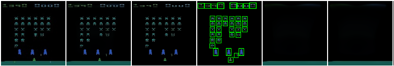

# SPACE

This is the AIML Rework of the SPACE model presented in the following paper:

> [SPACE: Unsupervised Object-Oriented Scene Representation via Spatial Attention and Decomposition](https://arxiv.org/abs/2001.02407)  



[link to the original repo](https://github.com/zhixuan-lin/SPACE)

## General

Project directories:

* `src`: source code
* `data`: where you should put the datasets
* `output`: anything the program outputs will be saved here. These include
  * `output/checkpoints`: training checkpoints. Also, model weights with the best performance will be saved here
  * `output/logs`: tensorboard event files
  * `output/eval`: quantitative evaluation results
  * `output/demo`: demo images
* `scripts`: some useful scripts for downloading things and showing demos
* `pretrained`: where to put downloaded pretrained models

This project uses [YACS](https://github.com/rbgirshick/yacs) for managing experiment configurations. Configurations are specified with YAML files. These files are in `src/configs`. We provide five YAML files that correspond to the figures in the paper:

* `3d_room_large.yaml`: for the 3D Room Large dataset
* `3d_room_small.yaml`: for 3D Room Small dataset
* `atari_spaceinvaders.yaml`: for the Space Invaders game
* `atari_riverraid.yaml`: for the River Raid game
* `atari_joint.yaml`: for joint training on 10 Atari games

## Dependencies

:bangbang: I made it work with PyTorch 1.8.0 (last version)

If you can use the default CUDA (>=10.2) version, then just use
```
pip3 install -U pip
pip3 install -r requirements.txt
```

## Quick demo with pretrained models

To download pretrained models, two options are available:

* **Download with scripts**. Run the following script to download pretrained models:

  ```
  sh scripts/download_data_atari.sh  # for atari data only
  ```
or
  ```
  sh scripts/download_pretrained.sh  # for all data
  ```

  Pretrained models will be downloaded to the `pretrained` directory and decompressed.

To generate the image of the atari game with the bounding box:
```
sh scripts/show_atari_spaceinvaders.sh 'cuda:0'  # if you have a GPU
sh scripts/show_atari_spaceinvaders.sh 'cpu'  # otherwise
```

## :space_invader: AIML SCRIPTS :space_invader:

Depending on your setup you might have to do further installations:

```
pip3 install torch==1.9.0+cu111 torchvision==0.10.0+cu111 torchaudio===0.9.0 -f https://download.pytorch.org/whl/torch_stable.html // tried with nvcc -V == 11.2
pip3 install git+git://github.com/mila-iqia/atari-representation-learning.git
git clone https://github.com/ml-research/mushroom-rl && cd mushroom-rl
pip3 install --no-use-pep517 -e .[all]
pip3 install airspeed
git clone https://github.com/ml-research/rational_activations && cd rational_activations
python3 setup.py develop --user
```

We have our own scripts:
* To create a dataset for the game pong (`train` folder): <br/>
`python3 create_dataset.py -f train -g Pong`

* To create a dataset for the game Tennis (`train` folder) and make the data i.i.d.: <br/>
`python3 create_dataset.py -f train -g Tennis --random`

* To extract images for a game: <br/>
`python3 extract_bb.py --config configs/atari_spaceinvaders.yaml resume True resume_ckpt ../pretrained/atari_spaceinvaders.pth device cuda:0 `

* To create a PCA (or tsne) and visualize in a plot: (only available for MsPacman) <br/>
`python3 classify_z_what.py show -method pca -dim 2`
(This needs labeled generated data, contact Quentin to get the arxiv)

## Training and Evaluation

**First, `cd src`.  Make sure you are in the `src` directory for all commands in this section. All paths referred to are also relative to `src`**.

The general command to run the program is (assuming you are in the `src` directory)

```
python main.py --task [TASK] --config [PATH TO CONFIG FILE] [OTHER OPTIONS TO OVERWRITE DEFAULT YACS CONFIG...]
```

Detailed instructions will be given below.

**Training**. Run one or more of the following to train the model on the datasets you want:

* River Raid:

  ```
  python main.py --task train --config configs/atari_riverraid.yaml resume True device 'cuda:0'
  ```

* Space Invaders:

  ```
  python main.py --task train --config configs/atari_spaceinvaders.yaml resume True device 'cuda:0'
  ```

* Joint training on 10 Atari games:

  ```
  python main.py --task train --config configs/atari_joint.yaml resume True device 'cuda:0'
  ```

These start training with GPU 0 (`cuda:0`). There some useful options that you can specify. For example, if you want to use GPU 5, 6, 7, and 8 and resume from checkpoint `../output/checkpoints/3d_room_large/model_000008001.pth`, you can run the following:

```
python main.py --task train --config configs/3d_room_large.yaml \
	resume True resume_ckpt '../output/checkpoints/3d_room_large/model_000008001.pth' \
	parallel True device 'cuda:5' device_ids '[5, 6, 7, 8]'
```

Other available options are specified in `config.py`.

**Training visualization**. Run the following

```
# Run this from the 'src' directory
tensorboard --bind_all --logdir '../output/logs' --port 8848
```

And visit `http://[your server's address]:8848` in your local browser.

## Issues

* For some reason we were using BGR images for our Atari dataset and our pretrained models can only handle that. Please convert the images to BGR if you are to test your own Atari images with the provided pretrained models.
* There is a chance that SPACE doesn't learn proper background segmentation for the 3D Room Large datasets. Due to the known [PyTorch reproducibity issue](https://pytorch.org/docs/stable/notes/randomness.html), we cannot guarantee each training run will produce exactly the same result even with the same seed. For the 3D Room Large datasets, if the model doesn't seem to be segmenting the background in 10k-15k steps, you may considering changing the seed and rerun (or not even changing the seed, it will be different anyway). Typically after trying 1 or 2 runs you will get a working version.

## Use SPACE for other tasks

If you want to apply SPACE to your own task (e.g., for RL), please be careful. Applying SPACE to RL is also our original intent, but we found that the model can sometimes be unstable and sensitive to hyperparameters and training tricks. There are several reasons:

1. **The definition of objects and background is ambiguous in many cases**. Atari is one case where objects are often well-defined. But in many other cases, it is not. For more complicated datasets, making SPACE separate foreground and background properly can be something non-trivial.
2. **Learning is difficult when object sizes vary a lot**. In SPACE, we need to set a proper prior for object sizes manually and that turn out to be crucial hyperparameter. For example, for the 10 Atari games we tested, objects are small and roughly of the same size. When object sizes vary a lot SPACE may fail.

That said, we are pleased to offer discussions and pointers if you need help (especially when fine-tuning it on your own dataset). We also hope this will facilitate future works that overcome these limitations.


## Acknowledgements

Please refer to [the original model](https://github.com/zhixuan-lin/SPACE) for this.
